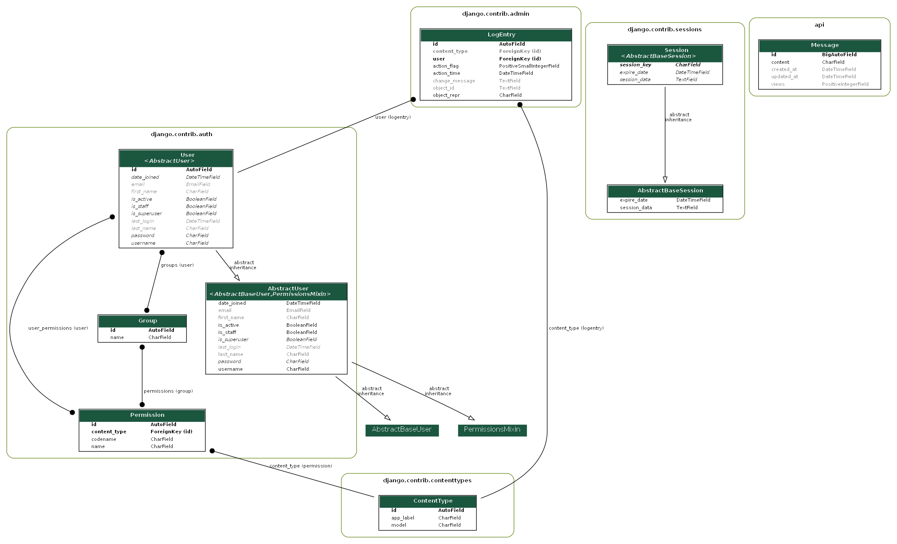
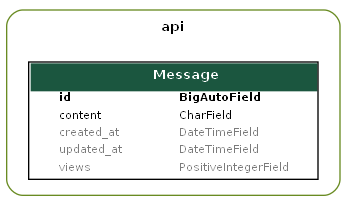

<div align="center">
    <h1>MessagesAPI</h1>
</div>

### Description:
**REST API** with CRUD operations on messages objects.
Users can send requests to API to view messages anonymously. 
In order to create/update/delete messages **JWT** is required.
(Authorization: Bearer {token} attached to the headers). API provides endpoints for registration and token retrieval.  
On every GET request, message's view count is incremented. 
It does not apply to the view which lists all of the messages but it could be added. 
On every PUT/PATCH request, message's content is updated and view count is set to 0.


### Used frameworks, libraries, tools, databases:
- Django + Django REST Framework

**Json Web Token authentication** is possible thanks to `rest_framework_simplejwt`, 
which provides JWT implementation including DRF views for obtaining and refreshing tokens.   

Tools: Pycharm IDE, Postman

Production database is Heroku Postgres. 
Postgres is also used by Github Actions where unit tests are ran.
Locally I used default SQLite database.

### Database schema:
ERD diagram including Django's base entities and manually created **Message** entity.


#### Message model:


Message has its own content which can be from 1 to 160 characters long.
It stores two datetime attributes: created_at and updated_at 
which both are initially set on record's creation. 
**View count has been implemented as an attribute**. 
When increasing view count, Django's [F expression](https://docs.djangoproject.com/en/3.2/ref/models/expressions/#f-expressions) 
is used in order to prevent race conditions and to increase performance.
The other possible way to tackle this problem 
was to create seperate model which would be store the hit counts (how many times view was visited).
Messages are saved and updated using modified ModelSerializer.

Message does not store information about its author - 
if this functionality was to be added, it would require adding Foreign Key to User
and storing Tokens in database in order to verify the user. 
(Right now server does the verification based on token's signature 
and its secret key, meaning that tokens are actually not stored in db)


### API Endpoints:
| HTTP Method | API endpoint            | Request body                                       | Response body                                                                                                                                           | Description                                                                    | Authorization header |
|-------------|-------------------------|----------------------------------------------------|---------------------------------------------------------------------------------------------------------------------------------------------------------|--------------------------------------------------------------------------------|----------------------|
| POST        | [api/auth/register/](https://messages-api-daftcode.herokuapp.com/api/auth/register/)       | Object {<br> username: str,<br> password: str<br>} | Object {<br> id: number,<br> username: str,<br> email: str,<br> first_name: str,<br> last_name: str,<br> is_admin: bool<br>}                            | Creates new user. Returns simplified user object.                              | None                 |
| POST        | [api/auth/token/](https://messages-api-daftcode.herokuapp.com/api/auth/token/)          | Object {<br> username: str,<br> password: str<br>} | Object {<br> refresh: str,<br> access: str<br>}                                                                                                         | Returns personal JWT access and refresh tokens.                                | None                 |
| POST        | [api/auth/token/refresh/](https://messages-api-daftcode.herokuapp.com/api/auth/token/refresh)  | Object {<br> refresh: str<br>}                     | Object {<br> access: str<br>}                                                                                                                           | Returns refreshed JWT access token.                                            | None                 |
| GET         | [api/messages ](https://messages-api-daftcode.herokuapp.com/api/messages)            |                          X                         | Array\<Object\> [<br> Object {<br>  id: number,<br>  content: str,<br>  views: number,<br>  created_at: datetime,<br>  updated_at: datetime,<br> }<br>] | Lists all of the existing message objects.                                     | None                 |
| POST        | [api/messages](https://messages-api-daftcode.herokuapp.com/api/messages)             | Object {<br> content: str<br>}                     | Object {<br> id: number,<br> content: str,<br> views: number,<br> created_at: datetime,<br> updated_at: datetime<br>}                                   | Creates and returns new message object with given content.                     | Bearer {token}       |
| GET         | [api/messages/{id}](https://messages-api-daftcode.herokuapp.com/api/messages/1)       |                          X                         | Object {<br> id: number,<br> content: str,<br> views: number,<br> created_at: datetime,<br> updated_at: datetime<br>}                                   | Retrieves message object with given ID.                                        | None                 |
| PUT         | [api/messages/{id}](https://messages-api-daftcode.herokuapp.com/api/messages/1)       | Object {<br> content: str<br>}                     | Object {<br> id: number,<br> content: str,<br> views: number,<br> created_at: datetime,<br> updated_at: datetime<br>}                                   | Perfoms full update on message object with given ID. Returns updated object.   | Bearer {token}       |
| PATCH       | [api/messages/{id}](https://messages-api-daftcode.herokuapp.com/api/messages/1)        | Object {<br> content: str<br>}                     | Object {<br> id: number,<br> content: str,<br> views: number,<br> created_at: datetime,<br> updated_at: datetime<br>}                                   | Perfoms partial update on message object with given ID. Returns updated object.| Bearer {token}       |
| DELETE      | [api/messages/{id}](https://messages-api-daftcode.herokuapp.com/api/messages/1)        |                          X                         |                                                                            X                                                                            | Deletes message object with given ID.                                          | Bearer {token}       |

Application also uses [Swagger](https://swagger.io/) for documentation purposes and 
also as a simpler and more visually appealing interface than individual REST Framework views. 
You can see its main view at [homepage](https://messages-api-daftcode.herokuapp.com/).

### Views:
There are 2 urls which need to be handled in REST type API, when it comes to messages. 
One for listing objects and creating new ones and one for operating on a specific object. 
Since in REST architecture there should not be endpoints 
such as `api/messages/delete/{id}`, `api/messages/{id}/update` or anything like that, 
there is no need for creating a view for each CRUD operation.

**`ListCreateMessageAPIView`**  handles `api/messages` endpoint. Allows GET, POST and safe methods HEAD, OPTIONS.  
**`GetUpdateDeleteMessageAPIView`**  handles `api/messages/{id}` endpoint. 
Allows GET, PUT, PATCH, DELETE and safe methods HEAD, OPTIONS.

### How to use this API:
Here are some examples how you can interact with API using different tools (curl, Javascript, Python).
I personally recommend using Postman.

Register yourself if you do not own account.
```shell script
curl -d "username=YourUserName&password=YourPassword" -X POST https://messages-api-daftcode.herokuapp.com/api/auth/register/
```
Get your JWT token. 
```javascript
const request = fetch('https://messages-api-daftcode.herokuapp.com/api/auth/token/', {
  method: 'POST',
  headers: {
    'Content-Type': 'application/json'  
  },
  body: JSON.stringify({
    username: 'YourUserName',
    password: 'YourPassword'
  })
})
  .then(res => res.json())
  .then(data => console.log(data))

const {refresh, access} = request;
```
If your token expires **(access token lives for 2 hours, refresh token - 24h)**:
```javascript
const refresh = 'refresh token you previously redeemed or had stored';

const request = fetch('https://messages-api-daftcode.herokuapp.com/api/auth/token/refresh/', {
  method: 'POST',
  headers: {
    'Content-Type': 'application/json'  
  },
  body: JSON.stringify({
    refresh: refresh,
  })
})
  .then(res => res.json())
  .then(data => console.log(data))

const {access} = request;
```
Now you can send requests to the API endpoints. Attach Authorization header if you want to POST/PUT/PATCH/DELETE.
```python
import json
import requests

token = 'your JWT access token'
headers = {
    'Authorization': f'Bearer {token}',
    'Content-Type': 'application/json' 
}

# get all messages - no token needed
messages = requests.get('https://messages-api-daftcode.herokuapp.com/api/messages')
print(messages.json())

# create new message
payload = json.dumps({'content': 'message content'})
new_message = requests.post('https://messages-api-daftcode.herokuapp.com/api/messages',
    data=payload,
    headers=headers
)
print(new_message.json())

# get message
message = requests.get('https://messages-api-daftcode.herokuapp.com/api/messages/1')
print(message.json())

# update message
payload = json.dumps({'content': 'updated content'})
updated_message = requests.post('https://messages-api-daftcode.herokuapp.com/api/messages',
    data=payload,
    headers=headers
)
print(updated_message.json())

# delete message
delete = requests.post('https://messages-api-daftcode.herokuapp.com/api/messages/2',
    headers=headers
)
print(delete.json())
```

### Testing:
All of API endpoints have their own unit tests. 
This repository has its own Github Workflows testing pipeline.
CI is ran on each push on any branch and pull request to master branch.  
##### `api/messages` tests:
- Get all messages (empty list or few objects)
- Unauthorized POST request
- Not allowed method
- Create message: with valid content, empty, 1 and 160 characters long, too long  
##### `api/messages/{id}` tests:
- Unauthorized PUT/PATCH/DELETE
- Get/Update/Delete but there's no id
- Get/Update/Delete message which does not exist
- Update message with too many characters
- Successfully Get/Update/Delete message  
##### `api/auth/...` tests:
- Register new user, get token for them, refresh token  
(views from external packages are already tested by the authors)

### Deployment:
This repository has been deployed to Heroku. You can visit API [here](https://messages-api-daftcode.herokuapp.com/)

#### Steps to reproduce deployment:
1. Create staticfiles folder and put any file into it. 
(Make sure you made an exception in .gitignore for this file. Mine is called temp.)
2. Make sure there is Procfile is root directory with these 2 lines:  
``release: python manage.py migrate --no-input``  
``web: gunicorn core.wsgi``
3. Set `DEBUG = False`, add `django_heroku.settings(locals())` on the bottom of settings.py.
Make sure your **requirements.txt** contains every needed package. You may want to update it with
``pip freeze > requirements.txt``.
4. Go to [Heroku](https://dashboard.heroku.com/) and add new app.
5. Go to Resources tab and install **Heroku Postgres** add-on.
6. Go to Settings tab and set **SECRET_KEY** in config vars. Add **heroku/python** buildpack.
7. Go to Deploy tab, connect your Github repository, select branch to deploy.
You can Enable Automatic Deploys or Deploy Branch manually.
8. App should be up and running at ``https://<name_of_app>.herokuapp.com``.

### Local development:
Create new virtual environment, activate it and install dependencies.
```shell script
py -3 -m venv venv

venv\Scripts\activate

pip install -r requirements.txt
```
Set **SECRET_KEY** in your environmental variables.  
You can also install `python-dotenv`, put `.env` file with secrets in root directory
and add those lines in settings.py. (Make sure .env is not being commited to git repository if you want to use this method)
```shell script
from dotenv import load_dotenv

load_dotenv()
```

Run migrations and create super user. (Making migrations might not be necessary)
```shell script
python manage.py makemigrations

python manage.py migrate  

python manage.py createsuperuser  
```
Run server and open your browser at `http://127.0.0.1:8000/`.
```shell script
python manage.py runserver
```
Run tests with coverage (unit tests + report)
```shell script
coverage run manage.py test

coverage report -m
```

### Possible future content (outside of task's requirements):
- User account customization
- Info about message's author (e.g Message model with FK to User).
- Permissions to access message (e.g only author can modify)
- Query endpoint (get message by other attributes than its id)
- Pagination (so that user would not receive everything at once)